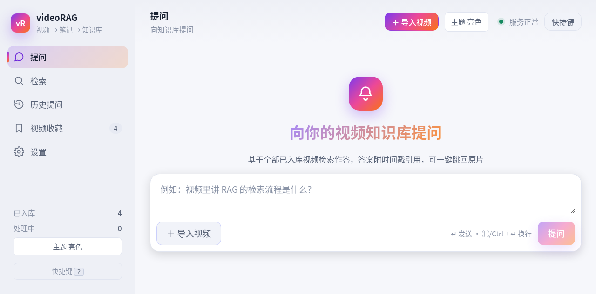
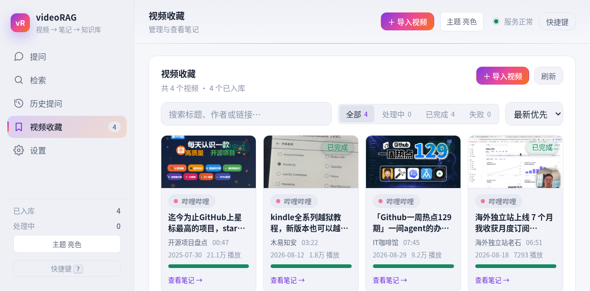
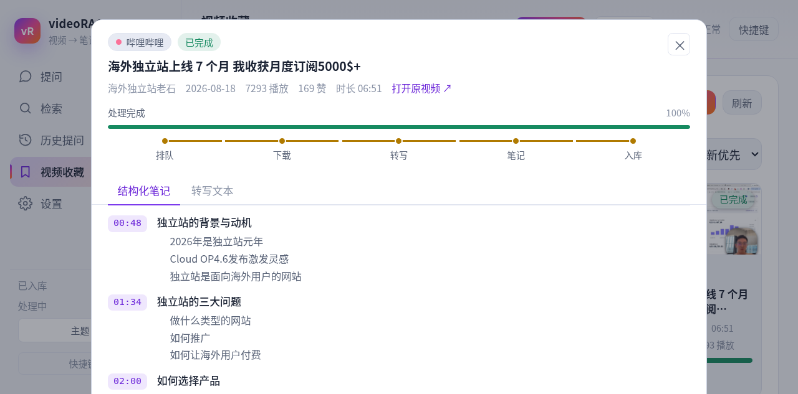

# videoRAG

把 B站 / YouTube /  任意直链的视频转成结构化笔记，落入 RAG 知识库，
支持自然语言问答（带时间戳引用，可跳回原视频）、关键词检索、Web UI 与 MCP agent 外挂。

**单容器 all-in-one**，纯 CPU 可跑，适合部署在 NAS / 家用服务器 / VPS。

## 产品截图

| 主页 · 向知识库提问 | 视频收藏 |
|---|---|
|  |  |

| 结构化笔记（带时间戳章节） |
|---|
|  |

## 功能特性

- **转写（本地默认）**：本地 SenseVoice 侧车（sherpa-onnx int8 ≈240MB，纯 CPU 可跑）；也可在设置中接入自定义 ASR 服务（需支持时间戳，见「本地 ASR」）
- **结构化笔记**：云 LLM 生成摘要 / 章节（带时间戳）/ 要点 / 术语表，导出 markdown
- **无语音视频画面采集（视觉旁路）**：纯音乐 MV / PPT 录屏 / 教程演示等「几乎没有对白」的视频，自动抽关键帧 + OCR 识别画面文字并入转写（转写页以 🖼 标记来源），笔记与检索同样可用；可在设置页在线开关与调参
- **RAG 问答**：中文混合检索（向量 + ngram 全文）+ LLM 生成，答案附可点击时间戳引用
- **Web UI**：提交链接、看进度、检索、读笔记，一步到位；提问页支持**多轮追问会话**（每轮问答保留可滚动回看，新提问自动滚动到可视区）
- **MCP 外挂**：暴露为 Streamable HTTP，你的 Cline CLI / 其他 agent 可直接查询知识库

## 快速开始（Docker）

```bash
docker build -t videorag .

docker run -d --name videorag \
  -p 8080:8080 \
  -v ./data:/data \
  -e LLM_PROVIDER=deepseek \
  -e LLM_API_KEY=sk-xxx \
  -e LLM_BASE_URL=https://api.deepseek.com \
  -e LLM_MODEL=deepseek-v4-flash \
  -e MCP_API_KEY=change-me \
  --restart unless-stopped \
  videorag
```

> 非 1000 UID 的宿主（群晖 NAS 常见 1026）：构建时传入自己的 UID/GID ——
> `docker build --build-arg APP_UID=$(id -u) --build-arg APP_GID=$(id -g) -t videorag .`；
> 否则 `./data` 会因属主不匹配报权限错误（可用 `sudo chown -R "$(id -u)":"$(id -g)" ./data` 修复）。

> 环境变量太多？也可以把配置写进项目根目录 `.env`（模板：`.env.example`，`cp .env.example .env` 后修改），不传 `-e` 即可，详见「配置方式」。

然后浏览器打开 `http://<nas-ip>:8080`。

> Embedding 默认**本地 fastembed**（无需远程服务）；ASR 默认本地 SenseVoice 档位（模型在「设置 → 本地模型」下载后，用 `docker compose --profile local-asr up -d` 起侧车），详见「本地 ASR」。

## docker-compose（推荐）

仓库根目录自带一份**标准初始化 compose**（无内网 IP / 密钥硬编码，配置全部经项目 `.env` 注入），开箱即用：

```bash
cp .env.example .env     # 1. 拷贝环境变量模板
# 2. 编辑 .env：至少填入 LLM_API_KEY（默认 DeepSeek；任意 OpenAI 兼容均可）
docker compose up -d     # 3. 启动 → http://localhost:8080
```

- **默认档位 = 纯本地可用**：Embedding 用内置 fastembed（`bge-small-zh`，首次使用自动下载，无需远程）；LLM 需填 key
- **本地 ASR（可选）**：首次启动后在「设置 → 本地模型」下载 SenseVoice 模型，然后
  `docker compose --profile local-asr up -d` 启动 sherpa-onnx 侧车（与主服务共享 `./data`，只读加载模型）
- **数据目录**：统一 `./data`（视频 / 向量库 / 笔记 / 模型 / runtime.env 全在里面，已被 .gitignore 忽略）
- **运行用户**：容器以非 root 用户运行，UID/GID 经 `VIDEORAG_UID` / `VIDEORAG_GID` 与宿主对齐（默认 1000，取值见 `id -u` / `id -g`）——`./data` 下文件属主即宿主用户，Docker 与裸机可无缝切换；改后需 `docker compose up -d --build`
- **本机已有数据**：用 `docker-compose.override.yml` 把 `./data` 改挂到真实目录即可（该文件已被 .gitignore 忽略，勿改动标准 compose）
- **完整字段与默认值**：见下方「环境变量参考」与 `.env.example`

不拷贝 `.env` 直接 `docker compose up -d` 也能启动，但 LLM 无 key 只能做转写/检索（见 FAQ）。

## 配置方式

配置项可通过**环境变量**或项目根目录的 **`.env` 文件**提供（环境变量优先，`.env` 其次，最后是默认值）。`.env` 已加入 `.gitignore`，模板见 [`.env.example`](.env.example)：

```bash
cp .env.example .env   # 按需修改
```

## 环境变量参考

| 变量 | 必填 | 默认 | 说明 |
|------|------|------|------|
| `LLM_PROVIDER` | - | `deepseek` | LLM 服务标识（deepseek / openai / 本地 vLLM 等，仅作标记） |
| `LLM_API_KEY` | ✅ | - | 云 LLM key（任意 OpenAI 兼容服务） |
| `LLM_BASE_URL` | - | `https://api.deepseek.com` | OpenAI 兼容 base_url |
| `LLM_MODEL` | - | `deepseek-v4-flash` | |
| `EMBED_PROVIDER` | - | `fastembed` | `fastembed`（本地 ONNX，CPU 友好，默认）或 `openai`（远程 /v1/embeddings，如 Ollama bge-m3） |
| `EMBED_MODEL` | - | `BAAI/bge-small-zh-v1.5` | `openai` 模式填远程模型名（如 `bge-m3:latest`） |
| `EMBED_BASE_URL` | - | 空 | `openai` 模式必填，如 `http://host:11434/v1` |
| `EMBED_API_KEY` | - | 空 | 远程服务无鉴权可留空 |
| `WHISPER_MODEL` | - | `large-v3` | 仅本地 faster-whisper 兼容档（`ASR_FALLBACK=whisper`）生效 |
| `CLOUD_ASR_PROVIDER` | - | 空 | 接入自定义 ASR 服务时设置（见「本地 ASR」）；**留空 = 本地 SenseVoice 侧车** |
| `CLOUD_ASR_BASE_URL` | - | 空 | 自定义 ASR 服务地址，如 `http://192.168.x.x:9991` |
| `CLOUD_ASR_KEY` | - | 空 | 无鉴权可填任意非空串 |
| `CLOUD_ASR_MODEL` | - | 空 | 可选，指定远程模型名（默认由服务决定） |
| `VISUAL_PIPELINE` | - | `auto` | 视觉旁路档位：`off` 关闭 / `auto` 检测到无语音才启用 / `always` 强制（调试） |
| `VISUAL_MIN_WPM` | - | `10` | 无语音判定阈值（字/分钟）：语音密度低于该值即视为无语音视频 |
| `VISUAL_MAX_FRAMES` | - | `60` | 送 OCR/VLM 的最大关键帧数（场景帧 + 每 30s 兜底帧，去重后封顶） |
| `VLM_BASE_URL` / `VLM_API_KEY` / `VLM_MODEL` | - | 空 | 画面描述层（VLM，OpenAI 兼容视觉模型）；**当前版本仅预留接口，不发起真实调用**，留空即不启用 |
| `MCP_API_KEY` | - | 空 | 设置后 MCP 端点需 Bearer 鉴权（compose 模板默认 `change-me`，建议修改） |
| `DATA_DIR` | - | `/data` | 数据根目录（容器内） |
| `COOKIE_DIR` | - | `/data/cookies` | 平台 cookie 目录 |
| `PORT` | - | `8080` | |
| `MAX_CONCURRENT_TASKS` | - | `1` | CPU 密集任务并发（NAS 建议 1） |
| `VIDEORAG_UID` / `VIDEORAG_GID` | - | `1000` | 容器运行用户的 UID/GID：与宿主对齐后，`./data` 不再出现 root 属主文件（Docker 与裸机可共用同一份数据）；取值见 `id -u` / `id -g`，改后需 `docker compose up -d --build` |

## 在线配置（Web 界面）

前端「设置」页（快捷键 `Alt+5`）分三个 Tab，改动保存后**即时热生效、无需重启容器**：

- **服务配置**：LLM / Embedding / ASR 三组服务连接参数 + 检索策略参数（召回条数、权重、相似度门槛等），每组带「测试连通性」探活；API Key 始终脱敏显示，掩码保存不会覆盖原值
- **本地模型**：SenseVoice / Embedding 模型下载与知识库重建
- **提示词**：笔记与问答提示词在线编辑

配置持久化到 `$DATA_DIR/runtime.env`（优先级：`runtime.env` > 环境变量 / `.env` > 代码默认值），由 Web 界面维护、请勿手工编辑；删除 `runtime.env` 后重启容器即恢复环境变量配置。

## 切换 Embedding 模型与向量库重建

切换 embedding 模型（如 `bge-m3` → 其他模型）后，向量库中的旧向量与新模型不在同一语义空间：

- **维度不同**：入库/检索时直接报「向量维度不匹配」并拒绝执行（响亮失败）
- **同维度不同模型**：无任何报错，但检索会静默变差（更危险）——向量库旁车文件 `model.meta.json` 记录了建库时的模型指纹（provider/model/dim），检索与入库前都会校验，不一致时抛错并指引重建

重建只需重嵌入，**无需重跑转写/笔记**（切片原文保存在 SQLite chunks 表）：

```bash
.venv/bin/python scripts/reembed_vector_store.py          # 交互确认
.venv/bin/python scripts/reembed_vector_store.py --yes    # 免确认
# 也可临时覆盖模型：--provider openai --model bge-m3:latest --base-url http://host:11434/v1
```

脚本会 drop LanceDB 表 → 按原 id 重嵌入重建 → 重建 FTS 索引 → 落盘新指纹，SQLite（含 `lancedb_id` 映射）完全不动。

也可在 Web 界面完成：**设置 → 本地模型 → 重建知识库**（后台任务执行，进度条实时轮询；重建进行中再次触发会提示冲突）。

## 首次启动说明

标准 compose 的默认档位 = **不依赖任何远程服务即可跑通转写与向量**：

1. **Embedding（默认本地）**：fastembed `BAAI/bge-small-zh-v1.5`（ONNX，≈190MB），首次使用自动下载到 `/data/models`，之后永久缓存
2. **ASR（默认本地，需两步）**：
   1. 打开 Web UI「设置 → 本地模型」，下载 **SenseVoice**（sherpa-onnx int8，≈240MB）到 `/data/models/asr`
   2. 启动侧车：`docker compose --profile local-asr up -d`（主服务经容器网 `http://asr:9991` 调用，模型目录共享只读）
   - 只跑主服务不启侧车也能用：转写会等 sidecar 就绪/给出可读错误；要完全离线必须完成这两步
3. **接入其他 ASR / Embedding 服务（可选）**：在 `.env`（或 Web「设置」页在线改）填 `CLOUD_ASR_*` / `EMBED_PROVIDER=openai` 即可；Web 设置页删空字段保存即切回本地，**无需重启**（ASR 服务要求见「本地 ASR」）
4. **没有 LLM key 时**：Web UI 正常，但「提问 / 笔记生成」会提示 `LLM_API_KEY is not configured`；下载转写与检索不受影响

> **国内网络下载模型慢/失败**：给容器加 `-e HF_ENDPOINT=https://hf-mirror.com` 走镜像站。
> 远程服务不可用时，Embedding 侧可在设置页切回 fastembed；ASR 侧启动 local-asr 侧车即可无缝接管（本地 ⇄ 在线切换见「在线配置」）。

## 本地 ASR

默认转写 = **本地 SenseVoice 侧车**（sherpa-onnx int8，纯 CPU 可跑，模型 ≈240MB）：

1. Web UI「设置 → 本地模型」下载 SenseVoice 模型（国内网络慢可配 `HF_ENDPOINT=https://hf-mirror.com`）
2. 启动侧车：`docker compose --profile local-asr up -d`
   - 侧车不暴露宿主端口，主服务经容器网 `http://asr:9991` 调用；模型目录与主服务共享 `./data`（只读加载）
   - 非 Docker 本地开发时，也可直接运行 `deploy/asr/server.py` 起服务
3. 验证：`docker compose ps` 中 `videorag-asr` 为 healthy，提交一个视频看转写进度即可

**使用其他 ASR 服务**：在「设置」页或环境变量中配置 `CLOUD_ASR_PROVIDER` / `CLOUD_ASR_BASE_URL` 即可接入任意 OpenAI 兼容转写服务（`/v1/audio/transcriptions`），需满足：

- **返回词/句级时间戳**（`verbose_json` / segments 格式）——答案的可点击时间戳引用、跳回原视频都依赖它
- 接受 **wav 16k mono** 音频（videoRAG 上传前会用容器内 ffmpeg 统一转码）
- 中文识别质量良好

## 平台与 cookie

| 平台 | 支持 | 需要 cookie？ |
|------|------|--------------|
| B站 / YouTube | 字幕/音频/视频 | 可选（提升稳定性） |
| 通用直链（mp4/m3u8 等） | 直接下载 | 否 |
| 抖音 / 小红书（未经测试不保证能用） | 音频/视频 | **必需** |

抖音/小红书需登录 cookie：用浏览器插件（如「Get cookies.txt LOCALLY」）导出 Netscape 格式
cookie，按文件名放入数据目录 `cookies/`：

```text
/data/cookies/douyin.txt          # 抖音（未测试）
/data/cookies/xhs.txt             # 小红书（未测试）
/data/cookies/bilibili.txt        # B站（可选）
/data/cookies/youtube.txt         # YouTube（可选）
```

未放 cookie 时，提交抖音/小红书链接会立即返回明确错误提示。

## MCP（agent 外挂）

MCP 端点：`http://<nas-ip>:8080/mcp`（Streamable HTTP，无状态）。

| 工具 | 说明 |
|------|------|
| `search_knowledge_base(query, top_k)` | 混合检索相关片段 |
| `ask_video_rag(question)` | RAG 问答，带引用 |
| `list_videos(platform?, keyword?, limit)` | 列出已入库视频 |
| `get_video_note(video_id)` | 结构化笔记 |
| `get_transcript(video_id, start?, end?)` | 带时间戳转写 |
| `submit_video(url)` | 提交视频入队 |

Cline CLI / 支持 Streamable HTTP 的 agent 配置（设置 `MCP_API_KEY` 后需带 Bearer）：

```json
{
  "mcpServers": {
    "video-rag": {
      "url": "http://<nas-ip>:8080/mcp",
      "headers": { "Authorization": "Bearer <MCP_API_KEY>" }
    }
  }
}
```

未设置 `MCP_API_KEY` 时无需 Bearer 头即可直接访问（本部署当前即无鉴权）。

### 快速验证（curl 探针）

MCP 走 JSON-RPC over Streamable HTTP。无鉴权时可直接用 curl 验证连通性与工具：

```bash
BASE=http://localhost:8080/mcp
# 1) 初始化握手
curl -s -X POST "$BASE" -H "Content-Type: application/json" \
  -H "Accept: application/json, text/event-stream" \
  -d '{"jsonrpc":"2.0","id":1,"method":"initialize","params":{"protocolVersion":"2024-11-05","capabilities":{},"clientInfo":{"name":"probe","version":"1.0"}}}'
# 2) 列出全部工具（应返回 6 个：search_knowledge_base / ask_video_rag /
#    list_videos / get_video_note / get_transcript / submit_video）
curl -s -X POST "$BASE" -H "Content-Type: application/json" \
  -H "Accept: application/json, text/event-stream" \
  -d '{"jsonrpc":"2.0","id":2,"method":"tools/list","params":{}}'
# 3) 调用检索工具
curl -s -X POST "$BASE" -H "Content-Type: application/json" \
  -H "Accept: application/json, text/event-stream" \
  -d '{"jsonrpc":"2.0","id":3,"method":"tools/call","params":{"name":"search_knowledge_base","arguments":{"query":"RAG 检索","top_k":3}}}'
```

> 注意：MCP 工具的 `search_knowledge_base` / `ask_video_rag` 默认 `top_k=5`（与 Web `/api` 的默认 `top_k=8` 不同）；所有工具返回值为 JSON 字符串（`content[0].text`）。

## 更新升级

```bash
cd videoRAG
git pull
docker compose up -d --build          # 主服务重建（启用本地 ASR 加 --profile local-asr）
# /data 卷数据保留，无需任何迁移
```

也可手动 `docker run` 方式：`docker build -t videorag . && docker rm -f videorag` 后按原命令重新启动。

> **从「以 root 运行」的旧版本升级（重要，一次性）**
>
> 容器现已改为以宿主用户身份运行（UID/GID 由 `VIDEORAG_UID` / `VIDEORAG_GID` 决定）。
> 若数据目录里已有旧版容器写入的 **root 属主**文件，新版本会写不进去，表现为入库报
> `Permission denied` / `LanceError(IO): ... (os error 13)`。升级前先修复属主：
>
> ```bash
> # 数据目录按实际挂载路径替换（标准 compose 为 ./data；本机 override 为 ./.data）
> sudo chown -R "$(id -u)":"$(id -g)" ./data
> ```
>
> 若宿主 UID 不是 1000，同时确认 `.env` 里的 `VIDEORAG_UID` / `VIDEORAG_GID` 已按
> `id -u` / `id -g` 填写，再执行 `docker compose up -d --build` 重建。

## 常见问题（FAQ）

**Q：提交 B站视频失败 / HTTP 412？**
B站对数据中心 IP 有风控。把浏览器 cookie 导出为 `/data/cookies/bilibili.txt` 可显著提升成功率；家庭宽带 NAS 一般正常。

**Q：提问提示 LLM_API_KEY is not configured？**
没配 `LLM_API_KEY` 环境变量，笔记与问答功能不可用；下载/转写/检索不受影响。

**Q：转写很慢？**
本地 SenseVoice 侧车（sherpa-onnx int8，CPU）纯 CPU 转写 1 小时视频约数分钟。若转写卡住，先确认模型已下载且 `docker compose ps` 里 `videorag-asr` 为 healthy；对速度有更高要求可在设置中接入外部 ASR 服务（见「本地 ASR」）。Embedding 本地 fastembed 同样 CPU 可跑。

**Q：转写返回「字幕由 Amara.org 社群提供」「字幕志愿者 杨茜茜」之类奇怪文字？**
模型对静音/无语音片段会"脑补"字幕式文案（幻觉），属模型正常行为，不影响真实人声识别。测试素材请用带人声的音频。

**Q：数据存在哪里？**
全部在挂载卷 `/data` 下：SQLite（元数据/任务）、LanceDB（向量）、notes（markdown）、models（模型缓存）。删除容器不丢数据，备份该目录即可。

## 本地开发

```bash
uv venv .venv
uv pip install -p .venv/bin/python -i https://pypi.tuna.tsinghua.edu.cn/simple -e ".[dev]"
.venv/bin/python -m pytest                # 运行测试
.venv/bin/python -m uvicorn app.main:app --port 8080

cd web
npm install --registry=https://registry.npmmirror.com
npm run dev                                # 前端开发服务器（/api 代理到 8080）
npm run build                              # 构建产物 web/dist，由后端托管
```

本地免配置演示（无需 key / 模型 / 外网）：

```bash
python scripts/dev_demo.py                 # http://localhost:8080，预置 3 个演示视频
```

## 数据目录（/data 卷）

```
/data
├── downloads/    # 临时下载，转写后清理
├── audio/        # 抽取的音频
├── transcripts/  # 转写 JSON
├── notes/        # 结构化笔记 markdown
├── db/           # SQLite（元数据/任务）
├── lancedb/      # 向量库
├── models/       # whisper + embedding 模型缓存
└── cookies/      # 平台 cookie
```

## 致谢

本项目站在众多优秀开源项目的肩膀上，感谢：

- [yt-dlp](https://github.com/yt-dlp/yt-dlp) — 全平台视频/字幕/元数据获取的核心
- [FunASR](https://github.com/modelscope/FunASR) 与 [SenseVoice](https://github.com/FunAudioLLM/SenseVoice) — 高质量中文语音识别模型（词/句级时间戳）
- [sherpa-onnx](https://github.com/k2-fsa/sherpa-onnx) — 本地 ASR 侧车的轻量推理引擎（int8 量化，纯 CPU 可跑）
- [faster-whisper](https://github.com/SYSTRAN/faster-whisper) — 本地兼容转写档
- [fastembed](https://github.com/qdrant/fastembed) 与 [BAAI/bge-small-zh-v1.5](https://huggingface.co/BAAI/bge-small-zh-v1.5) — 本地向量化（ONNX，CPU 友好）
- [LanceDB](https://github.com/lancedb/lancedb) — 嵌入式向量数据库
- [FastAPI](https://github.com/fastapi/fastapi) · [SQLite](https://www.sqlite.org/) — 后端服务与元数据存储
- [React](https://github.com/facebook/react) · [Vite](https://github.com/vitejs/vite) — Web 前端

## 设计文档

- `docs/plans/2026-08-31-video-rag-design.md`（高层设计：决策、架构、多级获取/转写策略、MCP）
- `docs/plans/2026-08-31-video-rag-technical-design.md`（技术设计：模块、数据模型、接口、实施任务）
